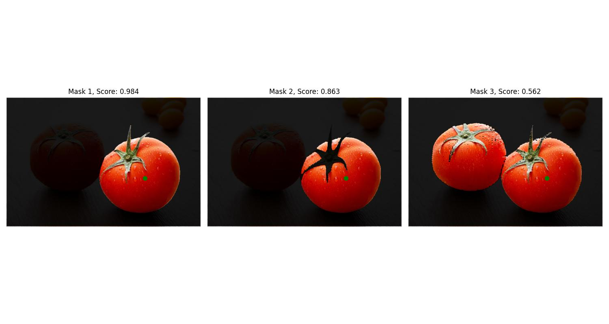
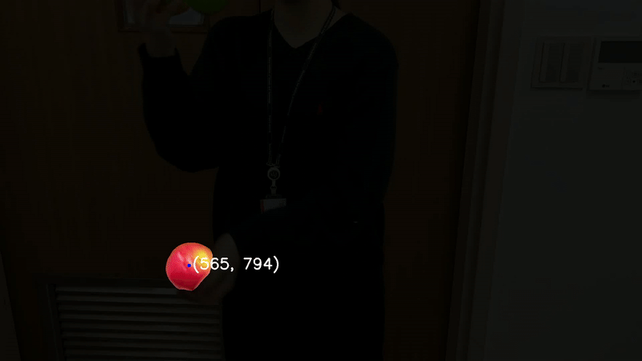
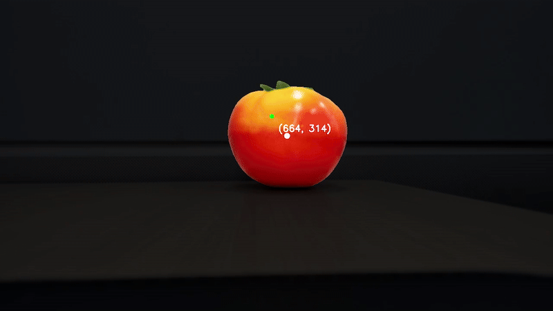

# segment-anything-2
Run Segment Anything Model 2 on a **static image**, **video** and **live video stream**

## Demo
<div align=center>
<p align="center">

### For static image

</p>

### For video

</p>

### For real-time video stream

</p>
</div>


## Getting Started

### Installation

```bash
pipenv shell
pipenv install
```
### Download Checkpoint

Then, we need to download a model checkpoint.

```bash
# excute on git bash
cd checkpoints
./download_ckpts.sh

```
