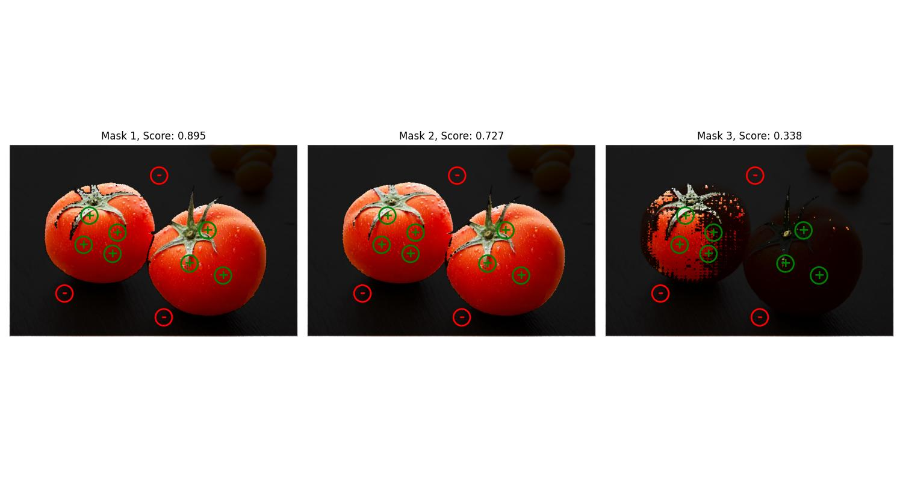

# segment-anything-2
Run Segment Anything Model 2 on a **static image**, **video** and **live video stream**

## Demo
<div align=center>
<p align="center">

### For static image

</p>

### For video

</p>

### For real-time video stream

</p>
</div>


## Getting Started

### Installation

```bash
pipenv install
pipenv shell
```
### Download Checkpoint

Then, we need to download a model checkpoint.

```bash
# excute on git bash
cd checkpoints
./download_ckpts.sh

```

### Run Demo

For static image
```bash
cd demo
python demo.py --input image --prompt p     # click point
python demo.py --input image --prompt b     # bounding box
```

For video
```bash
python demo.py --input video --prompt p     # click point
python demo.py --input video --prompt b     # bounding box
```

For real-time video stream
```bash
python demo.py --input real-time
```

### Inference on your own data

For static image
```bash
cd script
python inference_image.py --prompt p    # click point
python inference_image.py --prompt b    # bounding box
``` 

For video
```bash
cd script
python inference_video.py --prompt p    # click point
python inference_video.py --prompt b    # bounding box
```

For real-time video stream
```bash
cd script
python inference_real_time.py
```
